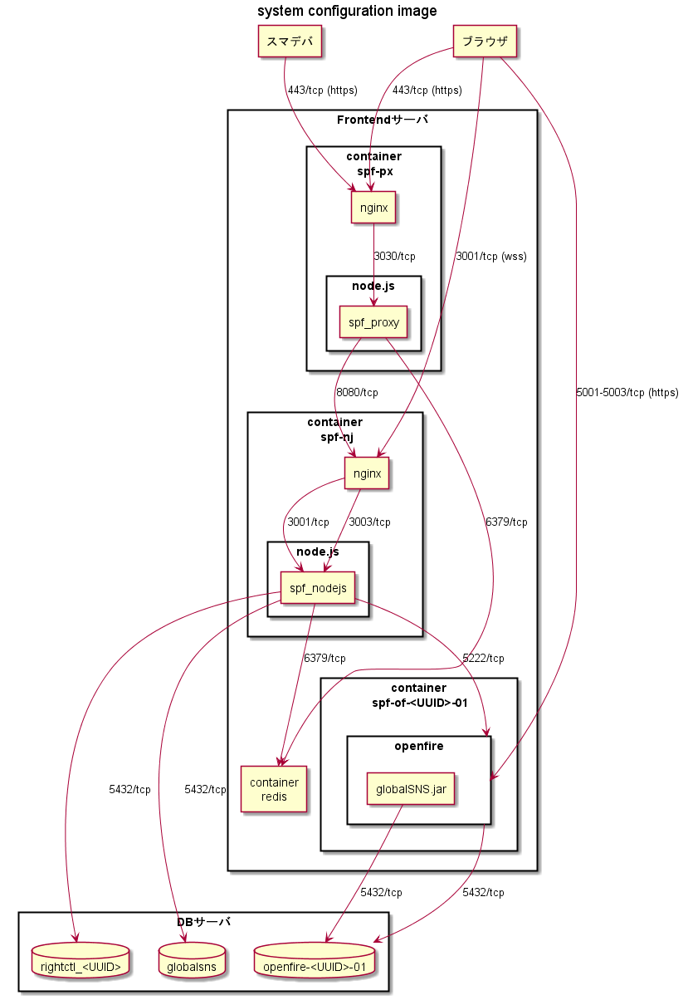
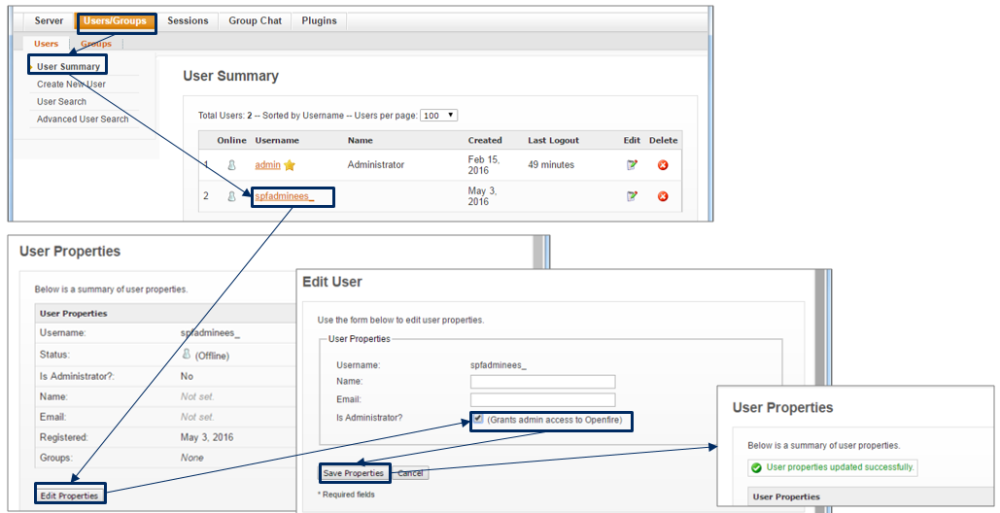

インストールガイド
===

本書は、サーバーへのインストール手順について説明するガイドである。


## 目次

1. [システム要件](#システム要件)
1. [システム構成](#システム構成)
1. [提供物件](#提供物件)
1. [留意点](#留意点)
1. 構築手順
    1. [はじめに](#はじめに)
    1. [パラメータの決定](#パラメータの決定)
    1. [スクリプトによる構築](#スクリプトによる構築)
    1. [証明書の配置](#証明書の配置)
    1. [起動と確認および停止](#起動と確認および停止)
    1. [LDAP連携する場合の追加構築](#LDAP連携する場合の追加構築)  
（LDAP連携をしない場合は、実施不要）
    1. [テナント管理者の追加](#テナント管理者の追加)

以上

***
システム要件
===

## ハードウェア要件

本製品を、Frontendサーバ、DBサーバの 2台で構成する場合の要件は下記の通り。

* AMD64 または Intel 64 アーキテクチャを搭載した CPU、最小 2コア、推奨 4コア以上
* 最小 2GB の RAM、推奨 4GB以上のRAM
* 最小 20GB の ディスク、推奨 80GB以上のディスク（最小、推奨共に OSのインストール容量を含まず）

## ソフトウェア要件

### クライアント

`()`内はバージョン。記載のないものは、最新バージョン。

* ブラウザ
    * Google Chrome
    * Mozilla Firefox
    * Microsoft Internet Explorer (11)
    * Microsoft Edge
* スマデバアプリ
    * 企業向けソーシャルプラットフォーム
        * Android
        * iOS

***
システム構成
===

## 構成図

本製品のシステム構成は、下図のとおり。




## 構成要素

以下のOSS、プログラムで構成する。

* Frontendサーバ
    * サーバにインストールするOSS
        * redis-cli 3.0.7
        * Docker version 1.12.6
        * docker-compose version 1.14.0
    * サーバにインストールするツール類
        * python-pip
            * crudini
        * yq
        * jq
        * gcc
        * make
    * docker iamge 内で利用するOSS,プログラムのうち、主要なもの（※1）
        * 公式 image
            * centos:centos7.3.1611
            * centos:centos6
            * redis:3.0.7
            * node:boron
        * 主要なOSS,プログラム
            * java-1.8.0-openjdk
            * openfire-4.4.1-0
            * node.js v6.11.4
            * nginx-1.12.2
            * ImageMagick 7.0.7
* DBサーバ
    * サーバにインストールするOSS
        * postgresql96-server-9.6.7

※1 詳細は、各 Dockerfile を参照のこと。


## データの保管について

本製品のデータは、DBサーバのDB、および、Frontendサーバの以下のディレクトリに格納される。

```
/var/lib/docker/volumes/opt_cubee_node_data/_data/
```

## ログのローテーションについて

ログの出力先は、parameter.sh で設定する。以下は、設定例である。 

```
/var/log/cubee/center/
```

ローテーションは、以下に設定する。

* /etc/logrotate.d/nginx
* /etc/logrotate.d/nodejs
* /etc/logrotate.d/redis
* /var/lib/docker/volumes/opt_openfire_conf/<TENANT_UUID>-01/log4j.xml


***

留意点
===

本書を用いて構築を行う場合の留意点について記載する。

* 本手順で構築すると、初期テナントを 1つ作成することとなります。
* Frontendサーバのサーバ証明書は正規のCA局で発行された証明書ではありません。[証明書の配置手順](#証明書の配置) に従い、置換してください。
* スマデバアプリへの通知を行う場合には、Push通知の証明書の配置、APIキーの設定を行ってください。
* LDAP連携は、[free-IPA](https://www.freeipa.org/page/Main_Page) を動作確認済みです。

***
はじめに
===

本手順に記載のコマンドは、管理者ユーザまたは管理者権限をもつユーザで実行すること。  
なお、手順に記載しているコマンドは、`root#` で表記している。


## 作業用ディレクトリの作成

作業用ディレクトリとインストール用ディレクトリを作成し、インストール用のファイルをダウンロードする。Frontendサーバ、DBサーバの両方で作業が必要。

```bash
root# mkdir -p /root/rebecca/workdir
root# mkdir -p /root/rebecca/instdir
root# mkdir -p /root/rebecca/mandir
root# cd /root/rebecca/
root# git clone git@github.com:rebecca-NES/rebecca.gi
root# mv rebecca-sv/building workdir
root# mv rebecca-sv/release instdir/building
```

## rpmパッケージの入手

以下のrpm パッケージを入手し、指定したディレクトリに配置する。各パッケージに付記したバージョン番号で動作確認を行った。

### パッケージ名
1.　ImageMagick-7.0.7-25.x86_64.rpm
2.　ImageMagick-lib-7.0.7-25.x86_64.rpm
3.　openfire-4.4.1-1.x86_64.rpm

### 配置ディレクトリ
1.　/root/rebecca/workdir/building/docker/images/spf_bare_nj
2.　/root/rebecca/workdir/building/docker/images/spf_bare_nj
3.　/root/rebecca/workdir/building/docker/images/spf_bare_of

### Frontendサーバ


```bash
/root/rebecca/instdir/building

  ./compose
    ./docker-compose.yml

  ./spf_bare_nj
  ./spf_bare_of
  ./spf_bare_px
  ./spf_nodejs
  ./spf_openfire
  ./spf_proxy
```

### DBサーバ

```bash
/root/rebecca/instdir/building

  ./postgres
    ./spf_nodejs
    ./spf_openfire
    ./spf_rightctl

```

***
パラメータの決定
===

インストールに必要なパラメータを説明する。


## スクリプト変数の決定

`building/parameters.sh` にパラメータを設定し、インストール前にshellにロードする。

```bash
root# vi building/parameters.sh
```

Frontendサーバ、DBサーバともに同じ設定が必要。
なお、FrontendサーバーとDBサーバは同じファイルを使うこと。

下表にて説明する。

| パラメータ名 | 指定要否 | 指定例 | 説明 |
| -- | -- | -- | -- |
| http_proxy<br>https_proxy<br>no_proxy | 任意 | (略) | ProxyサーバーのIPアドレス、ポート番号|
| HOST_IPADDRESS | 必須 | 192.168.3.3 | FrontendサーバのIPアドレス。|
| DATABASE_IPADDR | 必須 | ${HOST_IPADDRESS} | DBサーバのIPアドレスを指定する。|
| POSTGRES_PASSWORD | 必須 | password | DBサーバのPostgreSQLのpostgresアカウントのパスワード。 |
| CUBEE_OPENFIRE_PW | 必須 | (略) | 当該テナントにおけるシステム管理者アカウント（`admin`）のパスワード |
| HOST_NAME | 必須 | kvm_center | ログの出力先のディレクトリ名。`LOG_DIR` 変数にてパスを構成している。 |
| TENANT_NAME | 必須 | spf | 初期構築テナント名。<br>`0-9 a-z - _` の小文字のみ、256文字以内で指定。|
| TENANT_UUID | 必須 | (略) | 初期構築テナントを特定するキー。<br>`uuidgen -t` コマンドで生成したUUID。 |
| TENANT_CONF | 必須 | (略) | 初期構築テナントのテナント設定 |

下表のパラメータは、初期設定から変更しないこと。

| パラメータ名 |
| -- |
| WORK_DIR |
| BUILD_DIR |
| POSTGRESQL_GLOBALSNS_ADMIN_PW |
| POSTGRESQL_GLOBALSNS_PW |
| POSTGRESQL_OPENFIRE_PW |
| LOG_DIR |
| OPENFIRE_WEB_PORT |
| RIGHTCTL_USER |
| RIGHTCTL_PW |
| REDIS_PASSWORD |
| APNS_PASSPHRASE |
| NOWADAY |
| RELEASE_ZIP |
| TENANT_LICENSE |


### 初期構築テナントのテナント設定

`TENANT_CONF` について説明する。  
テナント毎に、このパラメータをJSON形式の値で設定する。設定例を以下に示す。  

```json
{
    "disclosable": {
        "ldap": {
            "ldapEnable": false,
            "ldapUpdatable": false
        },
        "passwordPolicy": {
            "complexityNumber": 32
        }
    }
}
```

| キー | 説明 |
| -- | -- |
| disclosable.ldap | テナントのLDAP連携状態を示す |
| disclosable.ldap.ldapEnable | true: LDAP連携があることを示す。これ以外は、LDAP連携が無いことを示す。 |
| disclosable.ldap.ldapUpdatable | true: LDAPデータ更新可否が、可であることを示す。これ以外は、不可であることを示す。 |
| disclosable.passwordPolicy.complexityNumber | テナント利用者がパスワードを変更する際の複雑性チェックの内容を示す。<br>0: 複雑性チェックは行わない。<br>32: 半角英字、半角数字、記号からそれぞれ1文字以上の使用が必要 |


#### LDAP連携有無の決定

LDAPとの連携を行う場合は、以下の設定を行う。  

```json
        "ldap": {
            "ldapEnable": true,
            "ldapUpdatable": false
        },
```

LDAPから本製品へのデータ連携を実現する手順は、本ガイド内の[LDAP連携する場合の追加構築](#LDAP連携する場合の追加構築)において説明する。


## 権限管理の決定

### スキーマの決定

#### 概要

権限管理のスキーマとして、以下を用意している。

* ノーマル
    * 選択できるアカウントタイプは、"メンバー" の１つのみ。全アカウントが同じ権限を持つこととなる。
    * ファイル名は、`rightctl_cubee.json`
* 3層権限
    * 選択できるアカウントタイプは、３つ。"メンバーA", "メンバーB", "ゲスト" のアカウントタイプがある。
    * ファイル名は、`rightctl_cubee_retail.json`

テナント管理者がアカウントごとに、それぞれのスキーマで選択可能なアカウントタイプを指定できる。

アカウントタイプとできることを下表にまとめる。

| スキーマ | アカウントタイプ | フィード | プロジェクト（※1） | グループチャット（※1） |
| -- | -- | -- | -- | -- |
| ノーマル | メンバー | 投稿/閲覧 | 作成 | 作成 |
| 3層権限 | メンバーA | 投稿/閲覧 | 作成 | 作成 |
| 〃 | メンバーB | 閲覧     | 作成 | 作成 |
| 〃 | ゲスト | 閲覧     | -   | -    |

※1 作成ができなくても、招待されることでそのプロジェクト/グループチャットの管理者になることができる。

#### 適用方法

適用するスキーマを定義したファイルをDBサーバー上の以下のパス、ファイル名で配置する。

`/root/rebecca/building/postgres/spf_rightctl/rightctl_cubee.json`


### 特殊権限の付与

#### 概要

テナント管理者向けの機能である、全メッセージ検索機能と、メッセージ削除機能を
使用できる権限を「特殊権限」と呼ぶ。特殊権限を使用する場合は、前述した
スキーマ定義ファイルを編集する。

#### 適用方法

以下のコマンドで、ファイルを更新する。（DBサーバ）

```bash
root# vi /root/cubee-dev/building/postgres/spf_rightctl/rightctl_cubee.json
```

下記に例を示す。行頭に `$` で示した記述を追加する。

```json
    "roles": [
        {
            "id": "normal",
            "role_tid": "normal",
            "policies": [
$               "p_surveillance_messages",
                "p_send_feed",
                "p_create_community",
                "p_create_groupchat"
            ]
        }
    ]
```


以上
***
シェルスクリプトの実行
===

`/root/cubee-dev/` ダウンロードしたシェルスクリプトを
Frontendサーバ、DBサーバ上で実行する。  

## Frontendサーバでの実行

```bash
root# cd /root/rebecca/workdir/building/
root# source parameters.sh
root# /bin/bash -xe system_settings.sh
root# /bin/bash -xe setup_epel.sh
root# /bin/bash -xe setup_comandline_tools.sh
root# /bin/bash -xe setup_docker.sh
root# /bin/bash -xe setup_docker-compose.sh
root# /bin/bash -xe setup_redis-cli.sh
root# /bin/bash -xe setup_redis-container.sh
root# /bin/bash -xe construct_spf_bare_px.sh
root# /bin/bash -xe construct_spf_bare_nj.sh
root# /bin/bash -xe construct_spf_bare_of.sh
root# /bin/bash -xe construct_configs.sh
root# /bin/bash -xe construct_configs_tenant.sh
root# /bin/bash -xe construct_spf_proxy.sh
root# /bin/bash -xe construct_spf_nodejs.sh
root# /bin/bash -xe construct_spf_openfire.sh
```

## DBサーバでの実行

```bash
root# cd /root/cubee-dev/building/
root# source parameters.sh
root# /bin/bash -xe system_settings.sh
root# /bin/bash -xe setup_epel.sh
root# /bin/bash -xe setup_postgresql.sh
root# /bin/bash -xe setup_db-with-one-tenant.sh
```
***
証明書の配置
===

証明書・APIキーの置換について説明する。

対象となるのは、以下の証明書およびAPIキーである。

* サーバ証明書
    * https用証明書
    * wss用サーバ証明書
    * Openfire管理コンソール(https)用サーバ証明書
* プッシュ通知証明書およびAPIキー
    * APNs アクセス用の証明書
    * GCM アクセス用のAPIキー

## 置換手順

特に記載のない限り、Frontendサーバで作業を行う。


### 外部通信用https用証明書

構築手順に従って構築した場合、
https用証明書は、docker イメージを build する際に作成した自己発行証明書を使用している。  
これを置き換えるには、docker ホストにマウントした場所に、正規のファイルを配置する。

なお、本製品が起動している場合は、停止・起動作業が必要である。

#### ファイルの配置

以下の2箇所のディレクトリに証明書を配置する。

```
/var/lib/docker/volumes/etc_pki_tls/spf-dckr-nj-0001/
/var/lib/docker/volumes/etc_pki_tls/spf-dckr-px-0001/
```

すでに以下のファイルが存在し、これに合わせたファイル名で配置すること。

| 相対パスでのファイル名 | 用途 |
| -- | -- |
| ./certs/server.crt | httpsサーバ証明書 |
| ./private/server.key | サーバ秘密鍵 |

所有者を `1000:1000` に変更する。

```bash
root# chown -R 1000:1000 /var/lib/docker/volumes/etc_pki_tls/spf-dckr-nj-0001
root# chown -R 1000:1000 /var/lib/docker/volumes/etc_pki_tls/spf-dckr-px-0001
```


### 内部通信用https用証明書およびwss用証明書

構築手順に従って構築した場合、
https用証明書は、docker イメージを build する際に作成した自己発行証明書を使用している。  
これを置き換えるには、docker ホストにマウントした場所に、正規のファイルを配置し、  
プログラムの設定ファイルを更新して、そのファイルを参照するよう設定する。

なお、本製品が起動している場合は、停止・起動作業が必要である。

#### ファイルの配置

以下のディレクトリに証明書を配置する。

```bash
/var/lib/docker/volumes/opt_cubee_cmnconf/_data/
```

所有者を `1000:1000` に変更する。

```bash
root# chown -R 1000:1000 /var/lib/docker/volumes/opt_cubee_cmnconf/_data/
```


#### 設定ファイルの更新

以下のコマンドで、設定ファイルを更新する。

```bash
root# vi /var/lib/docker/volumes/opt_cubee_node_conf/spf-dckr-nj-0001/server.conf
```

下記に書き換える。

```
HTTPS_SSL_CERTIFICATE_PATH=/opt/cubee/cmnconf/<https用証明書ファイル名>
HTTPS_SSL_CERTIFICATE_KEY_PATH=/opt/cubee/cmnconf/<https用秘密鍵ファイル名>
SOCKET_IO_SSL_CERTIFICATE_PATH=/opt/cubee/cmnconf/<wss用証明書ファイル名>
SOCKET_IO_SSL_CERTIFICATE_KEY_PATH=/opt/cubee/cmnconf/<wss用秘密鍵ファイル名>
```


### Openfire管理コンソール(https)用サーバ証明書

構築手順に従って構築した場合、
この証明書は、`truststore` というファイル名の、証明書ストアに格納されている、自己発行証明書を使用している。  
置き換えは不要。


### APNs アクセス用の証明書

構築手順に従って構築した場合、
この証明書は配置されず、APNs による iOS/スマデバアプリへの通知は行われない。  
通知を実現するには、APNsアクセス用の証明書およびパスフレーズを入手し、以下の手順で配置する必要がある。

なお、本製品が起動している場合は、停止・起動作業が必要である。

#### ファイルの配置

以下のディレクトリに証明書を配置する。

```bash
/var/lib/docker/volumes/opt_cubee_cert/_data/
```

所有者を `1000:1000` に変更する。  
`<>` は書き換えること。

```bash
root# chown 1000:1000 /var/lib/docker/volumes/opt_cubee_cert/_data/<ファイル名>
```


#### DBを更新する

以下のコマンドで、設定を更新する。（DBサーバ）

テナント毎に設定が必要なため、テナントのUUIDをまず取得する。  
※パスワードは、`/root/cubee/building/parameters.sh` の `POSTGRESQL_GLOBALSNS_ADMIN_PW` の値

```bash
root# psql -U globalsns_admin globalsns
ユーザ globalsns_admin のパスワード:
psql (9.6.7)
"help" でヘルプを表示します.

globalsns=> select uuid from tenant_store;
                 uuid                 
--------------------------------------
 XXXXXcdc-ea38-11e7-8d21-525400c17de2
 YYYYY196-e5d5-11e5-84b4-000c29690167
(2 行)

globalsns=> \q
```

テナント毎に psql コマンドで接続し、DB格納データを更新する。  
※パスワードは、`/root/cubee/building/parameters.sh` の `POSTGRESQL_GLOBALSNS_PW` の値

```bash
root# psql -U globalsns-<UUID> globalsns
ユーザ globalsns-<UUID> のパスワード:
psql (9.6.7)
"help" でヘルプを表示します.

globalsns=> select * from tenant_system_conf where conf_key in ('APNS_CERT_PASS', 'APNS_CERT_PATH', 'APNS_CERT_TYPE');
    conf_key    |               value               
----------------+-----------------------------------
 APNS_CERT_PASS | PASSWORD_FOR_APNS_CERT
 APNS_CERT_PATH | /opt/cubee/cert/spfe-ios-cert.p12
 APNS_CERT_TYPE | PRODUCTION
(3 行)

globalsns=> update tenant_system_conf set value = '<入手したパスフレーズ>' where conf_key = 'APNS_CERT_PASS';
UPDATE 1
globalsns=> \q
```

### GCM アクセス用のAPIキー

構築手順に従って構築した場合、
このAPIキーはDBに設定されておらず、GCMによる Android/スマデバアプリへの通知は行われない。  
通知を実現するには、APIキーを入手し、以下の手順で設定する必要がある。

なお、本製品が起動している場合は、停止・起動作業が必要である。

#### DBを更新する

以下のコマンドで、設定を更新する。（DBサーバ）  
※パスワードは、`/root/cubee/building/parameters.sh` の `POSTGRESQL_GLOBALSNS_ADMIN_PW` の値

```bash
root# psql -U globalsns_admin globalsns
ユーザ globalsns_admin のパスワード:
psql (9.6.7)
"help" でヘルプを表示します.

globalsns=> select * from system_conf where conf_key = 'GCM_API_KEY';
  conf_key   |                  value                  
-------------+-----------------------------------------
 GCM_API_KEY | XXXXXXXXXXXXSagbwVSx8n9p9IF5REa6lnwIyew
(1 行)

globalsns=> update system_conf set value = '<入手したパスフレーズ>' where conf_key = 'GCM_API_KEY';
UPDATE 1
globalsns=> \q

globalsns=> \q
```

以上
***
起動と確認および停止
===

起動、確認、停止について説明する。


## 起動

Frontendサーバ上で、以下のコマンドを実行してシステムを起動する。

```bash
root# cd /root/cubee/building/compose/
root# docker-compose up -d --force-recreate
```

起動コマンドの応答は、数秒必要。また、コマンド応答後に、実際にアクセスできるようになるまでに、数秒～数分間かかることがある。

## 確認

システム起動の確認方法を説明する。

### トップページへのアクセス

以下のコマンドで、アクセスできることを確認する。  
「出力例」で示した結果と同等の出力があればよい。

```bash
root# curl -XGET -I --insecure https://<Frontendサーバのアドレス>/cubee/index.html
(出力例)
HTTP/1.1 200 OK
Server: nginx/1.12.2
Date: Tue, 06 Mar 2018 09:05:53 GMT
Content-Type: text/html
Content-Length: 11751
Connection: keep-alive
last-modified: Mon, 19 Feb 2018 06:23:22 GMT
etag: "5a8a6d5a-2de7"
expires: Tue, 06 Mar 2018 09:05:53 GMT
cache-control: max-age=0, no-cache
accept-ranges: bytes

```

### 3001/tcp (wss) ポートへのアクセス

以下のコマンドで、ログイン画面にアクセスできることを確認する。  
10秒程度、応答がない状態であればよい。この場合、`Ctrl+c` でコマンドを停止する。

```bash
root# curl -XGET -I --insecure https://<Frontendサーバのアドレス>:3001/
```

### Openfire管理コンソールポートへのアクセス

以下のコマンドで、Openfire管理コンソールにアクセスできることを確認する。  
「出力例」で示した結果と同等の出力があればよい。

```bash
root#  curl -XGET -I --insecure https://<Frontendサーバのアドレス>:5001
(出力例)
HTTP/1.1 200 OK
Set-Cookie: JSESSIONID=apyq0zq221yi1hp6h1yke1um7;Path=/
Expires: Thu, 01 Jan 1970 00:00:00 GMT
Content-Type: text/html
Last-Modified: Tue, 28 May 2013 14:45:24 GMT
Accept-Ranges: bytes
Content-Length: 115
```


## 停止

Frontendサーバ上で、以下のコマンドを実行してシステムを停止する。

```bash
root# cd /root/cubee/building/compose/
root# docker-compose down
```

この操作を行っても、システム内のデータが失われることはない。

以上
***
LDAP連携する場合の追加構築
===

LDAP連携するテナントが存在する場合、主に２点作業が必要。

1. `Identity Synchronizer` （以降、is）を [構築する](#isの構築)
1. テナントのOpenfireの設定ファイルを、[LDAP連携する設定に変更する](#本製品側での、LDAP連携する設定)

上記作業ののち、[ユーザ情報を同期する作業](#同期をかける)を行う。


## isの構築

is は、本製品のオプションツールであり、LDAPからデータを取得し、本製品にユーザ情報の同期を実現する。  

※ダウンロードしたファイル群には含まれないので、適切な方法で入手すること。

### システム要件

is は、以下の要件を満たすこと。

* インターネットに接続可能なネットワーク
    * Frontendサーバー、DBサーバおよび、LDAPサーバに接続できる環境下に配置する。
* SSH接続可能なネットワーク

※）CentOS Linux release 7.4.1708 (Core)、Docker version 1.12.6, build 78d1802で動作することは確認している。


### 構築

#### 配置したフォルダを環境変数として設定する

```bash
root# export IS_DIR=<配置したフォルダ/is>
root# cd ${IS_DIR}
```

#### docker image としてビルドする

プロキシ環境下で動作させる場合。

```bash
root# docker build -f ./Dockerfile \
  -t spf-is \
  --no-cache=true \
  --build-arg http_proxy=${http_proxy} \
  --build-arg https_proxy=${https_proxy} \
  .
```

プロキシ環境下ではない場合

```bash
root# sed -ie "/^ARG http_proxy/d" Dockerfile
root# sed -ie "/^ARG https_proxy/d" Dockerfile
root# docker build -f ./Dockerfile \
  -t spf-is \
  --no-cache=true \
  .
```

#### 設定ファイルを更新する

以下のコマンドで設定ファイルを更新する。

```bash
root# vi ./conf/config.json
```

行頭 `$` 箇所を更新する。

```json
{
    "options": {
$       "mode": "csv"
    },
-(略)-
    "tenants": [
        {
            "spf": {
$               "uri": "https://SPF_HOST_ADDRESS/cubee/asynchronous/",
$               "tenantName": "spf",
$               "tenantAdmin": "admin",
$               "tenantAdminPassword": "adminpassword"
            },
            "ldap" : {
$               "uri": "ldap://LDAP_HOST_ADDRESS",
$               "baseDN": "dc=ipa,dc=test",
$               "adminDN": "uid=admin,cn=users,cn=accounts,dc=ipa,dc=test",
$               "adminPassword": "adminpassword",
$               "userBaseDN": "cn=users,cn=accounts,dc=ipa,dc=test",
                "usernameField": "uid",
                "accountTypes": {
                    "field": "title",
                    "matchings": [
                        {
$                           "ldapData" : "*",
$                           "accountType" : "normal"
                        }
                    ]
                }
            }
        }
    ]
}
```

各キーについて下表にて説明する。

| キー名 | 設定例 | 説明 |
| -- | -- | -- |
| options.mode | csv | のちの手順で、`sync` に更新する。<br>`csv` は、LDAPからデータを取得し、本製品に一括登録するCSVを出力するモード<br>`sync` は、LDAPから取得したデータで、本製品にユーザ情報の同期をかけるモード |
| tenants | (略) | 同期対象とするテナント毎の設定をもつ配列<br>複数のテナントを同期させたい場合は、記載例と同様の記述を追加する |
| tenants.spf | (略) | 本製品に接続するための情報を記載する |
| tenants.spf.uri | (略) | `SPF_HOST_ADDRESS` を、本製品のFrontendサーバのアドレスとする |
| tenants.spf.tenantName | spf | 同期するテナントのテナント名を指定する |
| tenants.spf.tenantAdmin | admin | テナント管理者のアカウント名を指定する。<br>システム管理者（`admin`）でも構わない。 |
| tenants.spf.tenantAdminPassword | adminpassword | tenantAdmin のパスワード |
| tenants.ldap | (略) | 同期元となるLDAPサーバへの接続情報を記載する |
| tenants.ldap.uri | (略) | `LDAP_HOST_ADDRESS` を、LDAPサーバのアドレスとする |
| tenants.ldap.baseDN | dc=ipa,dc=test | LDAPサーバ接続における baseDN を指定する |
| tenants.ldap.adminDN | (略) | LDAPサーバの admin の DNを指定する |
| tenants.ldap.adminPassword | adminpassword | LDAPサーバの admin の パスワードを指定する |
| tenants.ldap.userBaseDN | (略) | ユーザ情報が格納されているDNを指定する |
| tenants.ldap.accountTypes.matchings | (略) | アカウントタイプを同期させるための設定<br> `title` の値が、`ldapData` であれば、本製品でのアカウントタイプを `accountType` とするという記述をする。複数の設定が可能。<br>なお、`ldapData` の `"*"` は、any を示す。 |


#### ログのローテーション設定をする

下記のコマンドで、ローテーション設定を施す。

```bash
root# cat <<EOF > /etc/logrotate.d/spf-is
${IS_DIR}/spf-dckr-is/logs/*.log
{
    #
    # Identity Synchronizer (spf-is)
    #

    # No error when there is no file
    missingok

    # Do gzip
    compress

    # Everyday rotate and up to..
    daily rotate 397

    # DO NOT use this cos some log will be lost
    # copytruncate

}
EOF
```


#### LDAPへの接続を試行する

下記のコマンドで、CSV出力先を用意する。

```bash
root# mkdir -p ${IS_DIR}/cache
```

上述の ${IS_DIR}/conf/config.json における `options.mode` が `csv` であることを確認する。

下記のコマンドで、`is` を実行し、csv を ${IS_DIR}/cache に出力させる。

```bash
docker run \
    --rm   \
    -v ${PWD}/conf:/usr/src/app/conf    \
    -v ${PWD}/cache:/usr/src/app/cache  \
    -v ${PWD}/logs:/usr/src/app/logs \
    spf-is
```

正しく動作した場合には、\${IS_DIR}/cache に `<起動日時秒>_<テナント名>_reg.csv` ファイルが出力される。  
出力がない場合は、${IS_DIR}/logs/spf-is.log を参照し、設定の不備がないかを確認する。


#### ログの監視

ユーザ情報の同期を、定時実行にする場合、ログの監視が必要となる。

上述の ${IS_DIR}/logs/spf-is.log を監視対象とし、`ERROR`、`FATAL` の文言が含まれる場合にアラートを発する設定を推奨する。


## 本製品側での、LDAP連携する設定

テナント構築時に以下の作業を行うこと。

パラメータを読み込み、Openfire 設定ファイル `openfire.xml` を更新する。  
特に記載のない限り、Frontendサーバで行う。

なお、このほかに、[LDAP連携有無の決定](#LDAP連携有無の決定) の設定が、テナント構築時に必要。

### パラメータ読み込み

#### 初期テナントを対象とする場合

以下のコマンドで、パラメータを読み込む。

```bash
root# source /root/cubee-dev/building/parameters.sh
```

#### 増設テナントを対象とする場合

初期構築時に使用したパラメータ、今回用意したパラメータの順に読み込む。  
※`<>`箇所は書き換えること  
※対象のテナントを間違えないよう十分注意すること。

```bash
root# source /root/cubee-dev/building/parameters.sh
root# source /root/cubee-dev/building/parameters.<TENANT_NAME>.sh
```

### openfire.xml の更新

以下のコマンドで、設定ファイルを更新する。

```bash
root# vi /var/lib/docker/volumes/opt_openfire_conf/${TENANT_UUID}-01/openfire.xml
```

以下の、行頭 `$` で示した箇所を更新する。  
※`<!--` もしくは `-->` は該当行を削除する。

```xml
  <!-- ================
       Identity Reflecter 設定
       ================ -->
$  <!--
   <ir>
$    <ldap_enable>false</ldap_enable>
     <ldap>
$      <host>ipa-spf</host>
$      <port>389</port>
       <authCache>
         <enabled>true</enabled>
         <size>524288</size>
         <maxLifetime>7200000</maxLifetime>
       </authCache>
$      <baseDN>cn=users,cn=accounts,dc=ipa;dc=test</baseDN>
$      <usernameField>uid</usernameField>
     </ldap>
   </ir>
$  -->
```

| キー名 | 指定例 | 説明 |
| -- | -- | -- |
| ldap_enable | false | `false` から `true` に変更する |
| host | ipa-spf | 当該テナントのLDAPサーバのホスト名（もしくはIPアドレス） |
| port | 389 | LDAPサーバのldapポート |
| baseDN | cn=users,cn=accounts,dc=ipa;dc=test | LDAPアクセス時のbaseDN |
| usernameField | uid | LDAPアクセス時のアカウントを一意に特定するキー名（本製品のアカウント名） |


## 同期をかける

`is` の設定を変更し、ユーザ情報の同期をかける処理を実行する。  
またこの操作を crontab に設定し、定時実行するようにする。

### 本製品との同期をかける

上述の ${IS_DIR}/conf/config.json における `options.mode` を `sync` に変更する。

下記のコマンドで、`is` を実行し、本製品への同期をかける。

```bash
docker run \
    --rm   \
    -v ${PWD}/conf:/usr/src/app/conf    \
    -v ${PWD}/cache:/usr/src/app/cache  \
    -v ${PWD}/logs:/usr/src/app/logs \
    spf-is
```

${IS_DIR}/logs/spf-is.log を参照し、ERRORや、FATAL のメッセージがないことを確認する。  
メッセージがある場合、設定の不備がないかを確認する。

本製品の、admintool（https://<Frontendサーバのアドレス>/cubee/admintool）にテナント管理者でログインし、同期がなされているかを確認する。


### cronの設定をする

以上の手順で、同期・監視に問題がないことを確認したのちに、ユーザ情報同期を定時実行するよう、cron に設定を施す。

なお、${IS_DIR}/cache ディレクトリのハウスキーピング設定はここまでの設定では行っていない。  
動作的に問題が発生した場合の解析に必要となる場合があるが、このタイミングで削除しておく。

```bash
root# rm -rf ${IS_DIR}/cache
```

これにより、cron に登録するコマンドは、以下のようになる。  
※`<IS_DIR>` は実ディレクトリに書き換えること。

```bash
/usr/bin/docker run --rm -v <IS_DIR>/conf:/usr/src/app/conf -v <IS_DIR>/logs:/usr/src/app/logs spf-is
```

実行タイミングは、LDAPサーバのデータ状況などから検討して決定すること。


以上
***
テナント管理者の追加
===

新規に本製品を構築したときの初期テナント構築時や、テナントを増設したときには、そのテナントにはシステム管理者アカウントのみが存在する。  
テナント管理者を追加する手順について説明する。


## 目次

1. [パラメータの決定](#パラメータの決定)
1. [admintool からアカウントを追加](#admintoolからアカウントを追加)
1. [Openfire管理コンソールで権限を付与](#Openfire管理コンソールで権限を付与)


## パラメータの決定

テナント管理者に関する以下の情報を決定する。

* アカウント名
* ニックネーム
* アカウントタイプ
* 初期パスワード


## admintoolからアカウントを追加

本製品のadmintoolにアクセスし、システム管理者アカウントでログインする。

`https://<Frontendサーバのアドレス>/cubee/admintool/`

テナント名、システム管理者アカウントのアカウント名、パスワードが必要。  
初期テナントの場合、下表が該当する。

| 項目 | パラメータ名 |
| -- | -- |
| テナント名 | `/root/cubee-dev/building/parameters.sh` の `TENANT_NAME` |
| アカウント名 | admin |
| パスワード | `/root/cubee-dev/building/parameters.sh` の `CUBEE_OPENFIRE_PW` |

新規登録操作で、テナント管理者アカウントを作成する。


## Openfire管理コンソールで権限を付与

Openfire の管理コンソールをブラウザで開く。

`https://<Frontendサーバのアドレス>:<テナント毎のOpenfire管理コンソールのポート>`

テナント毎のOpenfire管理コンソールのポートは、  
`/root/cubee-dev/building/parameters.sh` の `OPENFIRE_WEB_PORT` が該当する。

システム管理者アカウント admin でログインする。  
下図を参考に、テナント管理者アカウントに、管理者権限を付与する。




***
